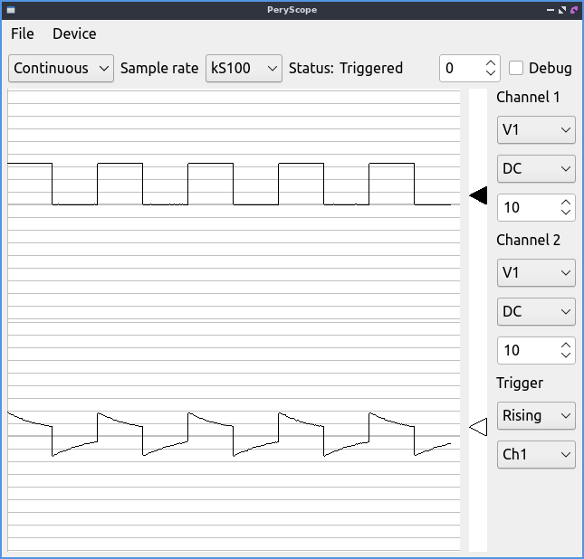

# Peryscope
Perytech PC USB Oscilloscope. [This one](https://www.perytech.com/USB-Oscilloscope.htm)

This is still in a demo level.




Add udev rule to allow access without root
/etc/udev/rules.d/99-perytech.rules
```
ACTION=="add", SUBSYSTEM=="usb", ATTR{idVendor}=="23e9", ATTR{idProduct}=="0001", TAG+="uaccess"
```
Install Qt and libusb and python requirements
```
sudo service udev reload
sudo apt-get install libusb-1.0-0 qtbase5-dev

pip3 install -r requirements.txt

./peryscope
```
